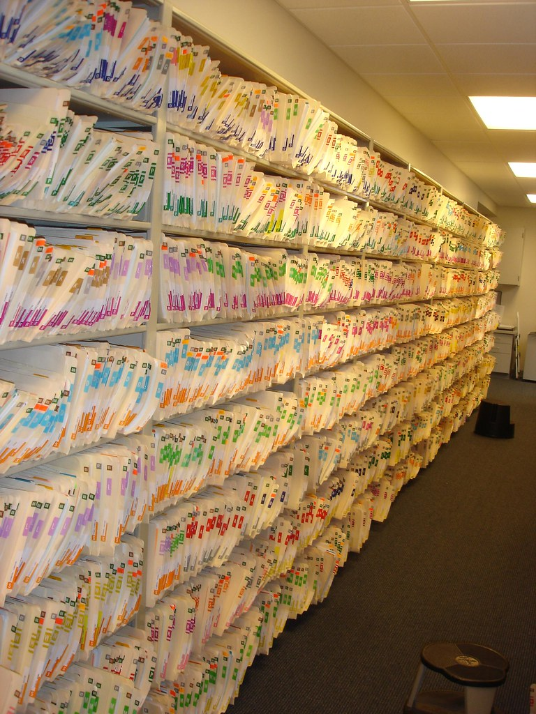
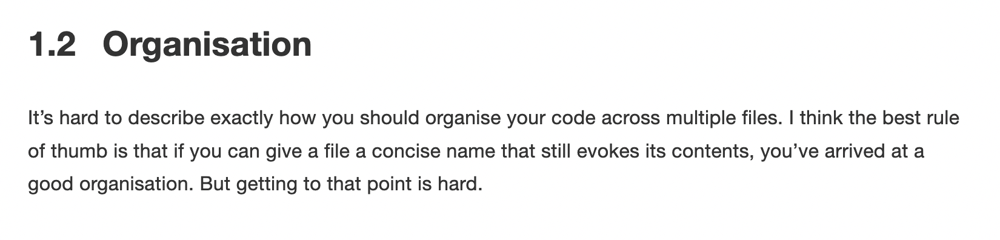
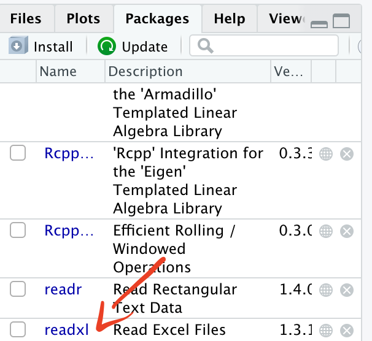
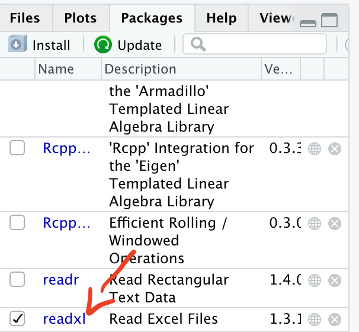
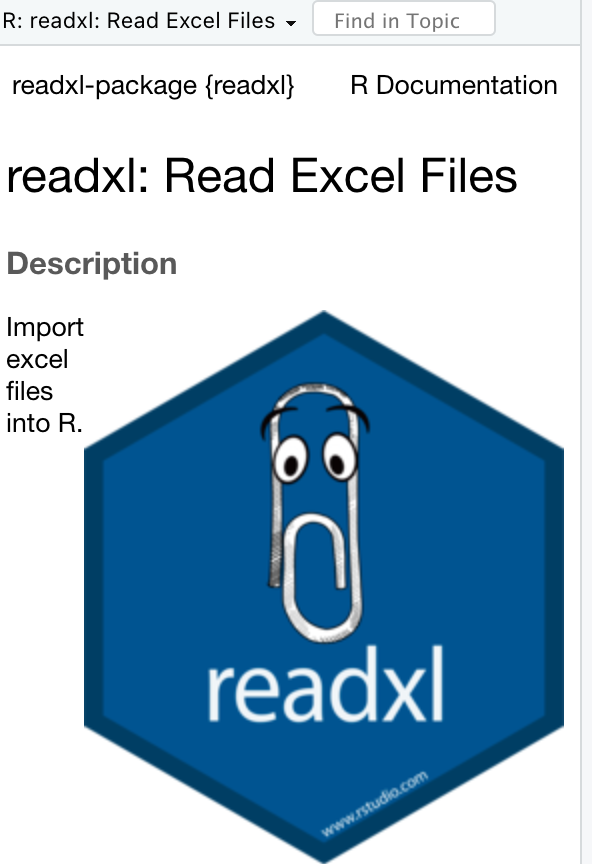
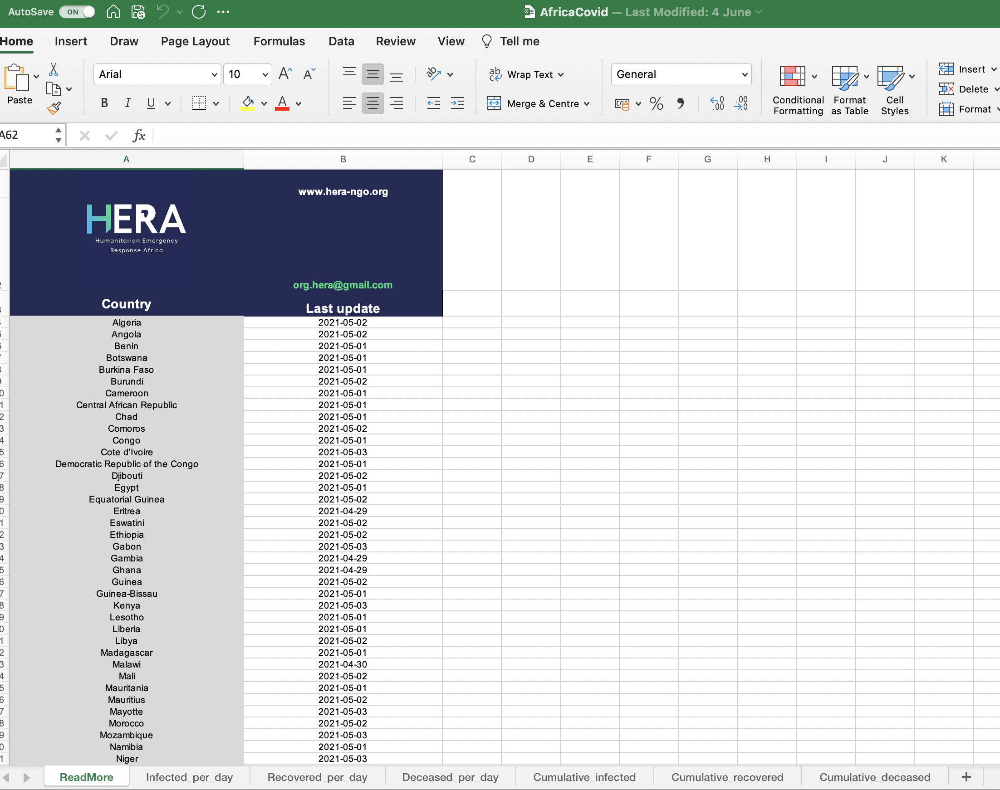
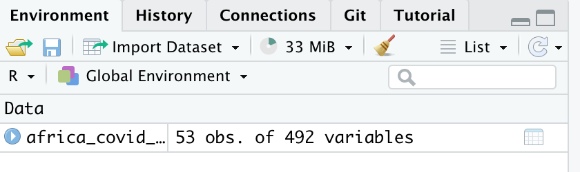

[**Aim**]{.ul}: Provide an introduction to R, RStudio and elementary R concepts

[**Intended Learning Outcomes:**]{.ul}

At the end of the session a successful student will be able to:

-   Discuss the benefits of using R over other software for epidemiological analysis

-   Understand how to install R, RStudio and R packages

-   Use the readxl package to import an Excel dataset to R

## What will be covered today?

-   [Course structure]
-   [Why R?]
-   [Installing R]
-   [Setting up files and folders]
-   [Navigating in R Studio]
-   [R packages]
-   [Objects]
-   [Importing data]
-   [Exporting data]
-   [Exercises]
-   [Useful resources]

## Course structure

6 teaching sessions drawing from several resources including the [Epidemiologist R handbook](https://epirhandbook.com/){target="_blank"}

-   An excellent resource for all skill/experience levels

-   Direct towards specific sections for you to work through in your own time

-   2 hours sessions, twice a week to present key topics and answer questions

## Why R?

[{width="400"}](https://data-flair.training/blogs/why-learn-r/)

Blog - [Why do we use R rather than Excel?](https://shkspr.mobi/blog/2021/07/why-do-we-use-r-rather-than-excel/){target="_blank"}

## Installing R

For this course, we will be using RStudio Cloud. This can be accessed [here](https://tinyurl.com/s9y8p55t){target="_blank"}. It is a very helpful tool for teaching R as it does not require any installation of R. It is free to register and you can follow on during the lecture or work through the notes in your own time.

If you would like to install R on your computer this link will be helpful.

[Guide to installing R](https://www.earthdatascience.org/courses/earth-analytics/document-your-science/setup-r-rstudio/){target="_blank"}

## Setting up files and folders

{width="300"}

### Best practice

Setting up files and folders will make your analysis (and life!) easier

-   Folder structure

-   Naming files and folders

#### Folder structure

R Studio works best when you use its project function

-   Each project contains all of your inputs, outputs and code

-   This also makes it easier to share folders with colleagues

    -   Everything is in one place!

Projects are covered in more detail in the Epidemiologist R handbook: [Chapter 6 "R Projects"](https://epirhandbook.com/r-projects.html)

#### Naming files and folders

If you want to share your code with colleagues or return to code after several weeks/months, you will be grateful that you gave your files and folders meaningful names! Many organisations have style guides to ensure that teams can collaborate on coding projects.

-   [Tidyverse style guide](https://style.tidyverse.org/files.html#names){target="_blank"}

[{width="800"}](https://style.tidyverse.org/files.html#names)

-   Key points to remember for naming

    -   Keep the name short

        -   Instead of "*data_import_of_file_for_analysis.R*"

            -   "*import_file.R*"

    -   Avoid spaces!

        -   Instead of "*import file.R*"

            -   "\_" "*import_file.R*"
            -   "-" "*import-file.R*"
            -   camelCase "*importFile.R*"

## Navigating in R studio

RStudio is the most popular option for working with the R programming language. The Epidemiologist R handbook has a section discussing the various windows you will see when you start RStudio : [3.5 RStudio](https://epirhandbook.com/r-basics.html#rstudio){target="_blank"}

[{width="600"}](https://epirhandbook.com/r-basics.html#rstudio)

## R packages

### What is an R package?

*Definition from the* Epidemiologist R handbook - 3.7 "[Packages](https://epirhandbook.com/r-basics.html#packages){target="_blank"}"

*"An R package is a shareable bundle of code and documentation that contains pre-defined functions. Users in the R community develop packages all the time catered to specific problems, it is likely that one can help with your work! You will install and use hundreds of packages in your use of R."*

Packages can simplify your workflow by combining multiple steps into a smaller number of commands.

Example: [**readxl**](https://readxl.tidyverse.org/){target="_blank"} is a package of functions used to import data from Excel to R.

### Installing a package

```{r eval=FALSE, echo=TRUE}
install.packages("readxl")
```

We have asked R to install the package **readxl**.

The installation has been successful. You do not need to reinstall the packages every time you start a new project as they are saved in your library.

-   In R, red text does not mean there has been an error! It means that R is warning you about something related to the function you have instructed R to apply to the data.

    Epidemiologist R handbook: [Section 3.13 Errors vs. warnings](https://epirhandbook.com/r-basics.html#errors-warnings){target="_blank"}

    You will now be able to see the package in your list of packages.

    {width="250"}

### Loading a package

Now that `readxl` has been installed, you will be able to load it and use its functions.

```{r}
library(readxl)
```

{width="250"}

When the package has been successfully loaded, you will see a tick mark in the box.

#### pacman

It is good practice to load all packages at the start of a script. This can help you to see which packages are being loaded and it ensures that you can write code without interruptions from the *library* command.

There is a package called **pacman** which can help with this process. When you run `pacman::p_load` you can list all of the packages you want to load. If the package has not previously been installed, **pacman** will install it. If the package has been installed, **pacman** will load it.

```{r}
pacman::p_load(readxl,here)
```

### Using a package

Each package has multiple functions that you can use on your data.

To read more about a particular package, type

```{r}
?readxl
```

{width="250"}

## Objects

So far we have installed, loaded and used a package (**readxl**). But how do we use the data generated from applying the functions? We assign the information to "objects".

[Section in Epidemiologist for R handbook about Objects](https://epirhandbook.com/r-basics.html#objects){target="_blank"}

*"Everything you store in R - datasets, variables, a list of village names, a total population number, even outputs such as graphs - are **objects** which are **assigned a name** and **can be referenced** in later commands."*

To explain objects, we will calculate a value, assign it to an object and then use the object for a second calculation.

```{r}
2+2
```

We can assign the calculation "2+2" to an object called "a".

```{r}
a <- 2+2
```

We can then use the object a to show the results of the calculation.

```{r}
a
```

We can also use this value for further calculations such as adding 4 to the object a.

```{r}
a + 4
b <- a+4

```

The result of this calculation is now stored in the object "b".

```{r}
b
```

## Importing data

For this example, we want to import data that is currently stored in an Excel formatted file ".xlsx". So we can use the function *`read_excel`* from the **readxl** package.

```{r}
read_excel(here('data','AfricaCovid','AfricaCovid.xlsx'))
```

But what does this show? And how can we use it?

-   Before importing a file from Excel, it can be helpful to open the file in Excel so we can see what data are stored in the file

{width="400"}

So when we tell R to use the function `read_excel`, it reads the first sheet which is called "ReadMore".It looks like this is a summary sheet with information about when data for each country was last updated. So how do we tell R to read in a different sheet from the Excel file?

*Question - How many confirmed cases of COVID were recorded across Africa in July 2020?*

First step - Import data from the sheet containing information on COVID cases

We can use the `excel_sheets` function from **readxl** to get the names of all sheets in the Excel workbook

```{r}
excel_sheets(here('data','AfricaCovid','AfricaCovid.xlsx'))
```

From this list we can see that we want to import data from the sheet "Infected_per_day".

```{r}
read_excel(here('data','AfricaCovid','AfricaCovid.xlsx'), sheet="Infected_per_day")
```

We can see a snapshot of the data from the sheet "Infected_per_day"

### Assigning data to an object

We have previously used the function `read_excel` from the package **readxl** to import data from an Excel spreadsheet.

However, we didn't assign this data to an object, so it is not possible to use the data from the import step.

We can assign the data to an object and then conduct further analysis.

```{r}
africa_covid_cases <- read_excel(here('data','AfricaCovid','AfricaCovid.xlsx'), sheet="Infected_per_day")
```

You will now see the object in the "Environment" section of R Studio.

{width="250"}

Now the data have been assigned to the object "`africa_covid_cases`", we can start to work with the data.

## Exporting data

Along with importing data, R can be used to export objects. This can be helpful if you need to send an analysis dataset to a colleague. There are many options for exporting data. The simplest is the `write.csv`function which is pre-installed when you run R

```{r eval=FALSE, echo=TRUE}
write.csv(africa_covid_cases, here('data', 'africa_covid_cases_long.csv'))
```

This will save a csv file containing the data from the africa_covid_cases_long object.

The package **readxl** contains several functions for importing data. There is another package called **writexl** which has multiple functions for exporting data.

```{r eval=FALSE, echo=TRUE}
install.packages("writexl")
```

**To use writexl to export a**

```{r}
library(writexl)
write_xlsx(africa_covid_cases, here('data', 'africa_covid_cases.xlsx'))
```

## Exercises

Go to the folder "exercises" and open the file "exercise-1.R"

## Useful resources

[Epidemiologist R handbook]{.ul}

-   Basics

    -   3: [R Basics](https://epirhandbook.com/r-basics.html){target="_blank"}

    -   4: [Transition to R](https://epirhandbook.com/transition-to-r.html){target="_blank"}

    -   5: [Suggested packages](https://epirhandbook.com/suggested-packages-1.html){target="_blank"}

    -   6: [R projects](https://epirhandbook.com/r-projects.html){target="_blank"}

    -   7: [Import/Export](https://epirhandbook.com/import-and-export.html){target="_blank"}

[R for Data Science](https://r4ds.had.co.nz/){target="_blank"}

[R for Excel users](https://jules32.github.io/r-for-excel-users/){target="_blank"}

[Awesome R learning resources](https://github.com/iamericfletcher/awesome-r-learning-resources){target="_blank"}

[Getting started with R and RStudio](https://rafalab.github.io/dsbook/getting-started.html){target="_blank"}
