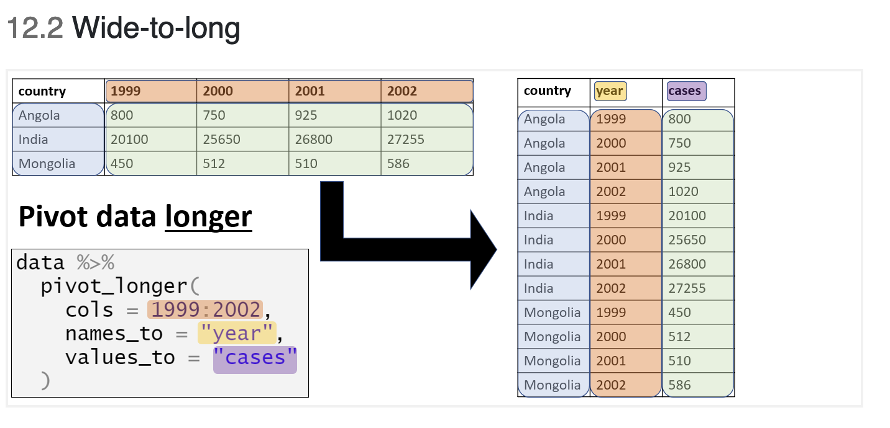
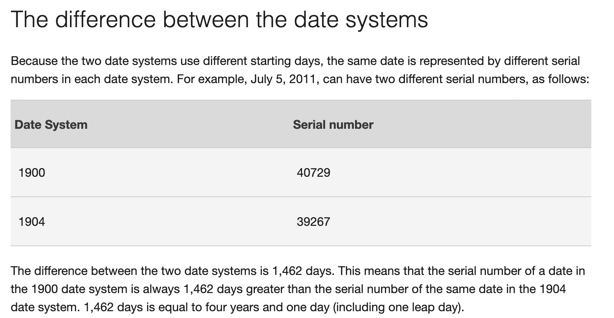

[**Aim:**]{.ul} To outline key concepts and "best practice" for working with data in R

[**Intended Learning Outcomes:**]{.ul}

At the end of the session a successful student will be able to:

-   Compare and contrast the different types of data in R

-   Describe the components of "tidy data" and its advantages

-   Discuss the differences between the various types of joins when merging data

## What will be covered today?

-   [Data types]

-   [Working with data]

-   [The tidyverse]

-   [Working with dates]

-   [Keeping your workspace clean]

-   [Useful resources]

## Data types

A key concept that is helpful to understand when you are learning R is that variables in R can be classified as a number of "types". The various "types" dictate which functions you can apply to your date. For example, if you had a dataset with the names and telephone numbers of all learners on this course, the variable with the name will be a different type to the variable containing the telephone number.

```{r}
name <- "Dave"
number <- 1234
# Check the data type using the function called class
class(name)
class(number)
```

For a more realistic example, we can look at the africa_covid_cases object which has been assigned to the Excel file we used in Session 1. To look at the data type for a whole data frame, we use the function str

```{r}
library(readxl)
library(here)
africa_covid_cases <- read_xlsx(here('data', 'africa_covid_cases.xlsx'))
str(africa_covid_cases)
```

The first 3 columns are of the class "chr" which is short for character. These are often known as "strings". We can see the remaining variables are of the class "num", which means that R has identified these variables as numbers.

Depending on the data type, we can apply different functions. For example, we can get the average of the first numeric column by typing.

```{r}
mean(africa_covid_cases$`43831`)
```

However, we cannot get the mean value of the character columns because they do not contain data that has been identified by R as a number.

```{r}
mean(africa_covid_cases$ISO)
```

## Working with data

In the `africa_covid_cases` object, there are 53 obs (observations) of 492 variables.

So what does this mean?

We can look at our data to get more information

```{r}
africa_covid_cases
```

ISO - 3 letter code assigned to each country

COUNTRY_NAME - Name of the country

AFRICAN_REGION - African region

43831, 43832, 43833 - This looks like a date format used by Excel. It is the number of days since January 1, 1970.

### Looking at your data

*Show the first 5 rows of the data frame.*

The function `head` tells R that we want to see the first few rows and `n=` specifies how many rows we want to see.

```{r}
head(africa_covid_cases, n=5)
```

*Show the last 7 rows of the data frame.*

```{r}
tail(africa_covid_cases, n=7)
```

How many unique countries are in the data?

```{r}
unique(africa_covid_cases$COUNTRY_NAME)
```

There are 53 unique country values. This is helpful as there are also 53 rows so we can say that each row represents a country. We can assign the list of unique countries to an object for future reference

```{r}
country_list <- unique(africa_covid_cases$COUNTRY_NAME)
```

### Looking at one variable

In the previous step, the following command was used

unique(africa_covid_cases\$COUNTRY_NAME)

What does "\$" do in R?

It allows us to look at a specific variable within the dataset

```{r}
unique(africa_covid_cases$AFRICAN_REGION)
```

And again we can assign this result to an object.

```{r}
region_list <- unique(africa_covid_cases$AFRICAN_REGION)
```

## The tidyverse

When using R, there are many approaches you can use to reach the same result.

There are thousands of packages with many functions and sometimes these packages can overlap.

This can be confusing when you are starting to learn R.

There is a collection of packages with many of the most commonly used packages, and this is called the [`tidyverse`](https://www.tidyverse.org/).

```{r}
tidyverse::tidyverse_packages()
```

We will use functions from some of these packages over the next few sessions.

### Tidy data

The key concept when working with packages from the tidyverse is the concept of "tidy data".

[R for Epidemiologist handbook 4.1 From Excel - Tidy data](https://epirhandbook.com/transition-to-r.html?q=tidy#tidy-data)

Principles of "[tidy data](https://r4ds.had.co.nz/tidy-data.html)":

1.  Each variable must have its own column.
2.  Each observation must have its own row.
3.  Each value must have its own cell.

Functions from the tidyverse packages are set up to work with tidy data. If your data are not tidy, then you will have to restructure the data to a tidy format. Restructuring can take a lot of time if the data are stored in Excel spreadsheets with a lot of formatting/merged columns.

[{width="450"}](https://www.openscapes.org/blog/2020/10/12/tidy-data/)

### Checking if data are tidy

In a previous step, we imported COVID case data from an Excel spreadsheet. But how do we know if the data are "tidy"

Remember there are 3 principles:

1.  Each variable must have its own column.
2.  Each observation must have its own row.
3.  Each value must have its own cell.

```{r}
head(africa_covid_cases, n=3)
```

So are the data "tidy"?

The data from the spreadsheet are not "tidy".

The columns "43831, 43832, 43833..." represent different dates. Therefore, this does meet the second argument of "tidy data" - "Each observation must have its own row".But we can reformat the data to make it "tidy" using functions from the packages included in the tidyverse

Remember, first we must install the packages from the tidyverse

`install.packages("tidyverse")`

### Tidying data

Now that the `tidyverse` has been installed, we can use the functions from the packages to "tidy" the data.

[{width="450"}](https://github.com/allisonhorst/stats-illustrations)

[{width="450"}](https://github.com/allisonhorst/stats-illustrations)

One package which is very helpful for this is called `tidyr`. Instead of loading individual packages, we can load the core tidyverse packages with one command.

```{r}
library(tidyverse)
```

The core packages contain powerful functions we can use to process, analyse and visualise data.

Remember to look at the documentation for a package type "?[name of package]"

Example -

`?tidyr`

To look at the functions within a package, type [name of package]::

Example

`tidyr::`

To reformat the data to a tidy format, we need to transform the data from wide to long.

The Epidemiologist R handbook has an excellent section describing how to do this

12 - [Pivoting data](https://epirhandbook.com/pivoting-data.html?q=pivot_long#pivoting-data)

### Wide to long

[{width="600"}](https://epirhandbook.com/pivoting-data.html?q=pivot_long#wide-to-long)

```{r wide_to_long}
africa_covid_cases_long <-
  africa_covid_cases %>% #tell R to use this dataset
  pivot_longer(cols = 4:492,#select the columns you want
               names_to = "excel_date", #name the new date column
               values_to = "cases") #name the new cases column

```

Transforming data from wide to long usually requires a few attempts to ensure you have achieved the correct outcome!

```{r}
head(africa_covid_cases_long, n=3)
```

This looks correct!

### Piping

When we created the object `africa_covid_cases_long`, you may have noticed this `%>%`

This is called a pipe and more information can be found in the Epidemiologist R handbook: [3.11 Piping](https://epirhandbook.com/r-basics.html#piping)

Pipes are used to link together multiple functions that you have instructed R to apply to a data frame. You can add comments to code to show other people (and remind yourself!) why you wrote the code in a particular way. Functions are carried out in the order they are linked to one another using pipes.

The example applies the concept of piping to a recipe for baking a cake.

```{r piping_example, eval=FALSE, echo=TRUE}
# A fake example of how to bake a cake using piping syntax

cake <- flour %>%       # to define cake, start with flour, and then...
  add(eggs) %>%   # add eggs
  add(oil) %>%    # add oil
  add(water) %>%  # add water
  mix_together(         # mix together
    utensil = spoon,
    minutes = 2) %>%    
  bake(degrees = 350,   # bake
       system = "fahrenheit",
       minutes = 35) %>%  
  let_cool()            # let it cool down
```

### Merging

So far we have been working through examples using one dataset which we imported from an Excel file. Often it is necessary to import additional datasets and merge the two datasets into one. The tidyverse makes this process straightforward but before working through an example, we will briefly discuss the different types of merges you can do in R.

#### Types of joins

[{width="450"}](https://docs.trifacta.com/display/DP/Join+Types)

This diagram shows some of the most common types of join you will encounter while working with data. When joining data, you need to tell R which column is in dataset A that can link to dataset B. The type of join depends on what relationship you are trying to achieve.

#### Example of a join

In africa_covid_cases_long we have information about the number of confirmed COVID-19 cases for countries in Africa. To compare the data between countries it would be helpful to have population data for each country. This will allow us to estimate the total COVID-19 cases per 100,000 people.

```{r}
#Import population dataset
population_data <- read.csv(here('data','world_population_2021.csv'))
summary(population_data)
head(population_data)
```

It looks like the dataset has one row for each country/region. There are 3 columns

```{r}
names(population_data)
```

The column "Location" will be used to join the population data to the africa_covid_long dataset. We can check the names of the columns in africa_covid_long to see what variable we can join on.

```{r}
names(africa_covid_cases_long)
```

"COUNTRY_NAME" will be used for the join. You will have noticed that the two datasets we are trying to join have different column names. Unlike other statistical programs (such as Stata), this is not a problem. We can use functions from the dplyr package to join the data.

```{r}
merged_data_left_join <- left_join(africa_covid_cases_long, 
                         population_data,
                         by=c("COUNTRY_NAME"="Location"))
str(merged_data_left_join)
```

The merge has successfully joined the COVID data and the population data. We can change the type of join to see how this changes the results.

```{r}
merged_data_inner_join <- inner_join(africa_covid_cases_long, 
                         population_data,
                         by=c("COUNTRY_NAME"="Location"))
str(merged_data_inner_join)
```

```{r}
merged_data_right_join <- right_join(africa_covid_cases_long, 
                         population_data,
                         by=c("COUNTRY_NAME"="Location"))
str(merged_data_right_join)
```

This is an important concept to understand. If the join is not doing what you want it to do, your analysis could be wrong!

Additional examples can be found in the Epidemiologist R handbook [14.2 dplyr joins](https://epirhandbook.com/joining-data.html#dplyr-joins)

## Working with dates

To add to the confusion, Excel has 2 additional date systems:

1.  1900 date system

2.  1904 date system

    {width="450"}

In the data set we are using, the dates are in this format:

```{r}
head(africa_covid_cases_long$excel_date)
```

We can use a function from another package to convert this to a standard date format.

```{r, eval=FALSE, echo=T}
install.packages("janitor")
```

```{r}
library(janitor)
```

The package [`janitor`](https://cran.r-project.org/web/packages/janitor/vignettes/janitor.html) has many helpful functions for cleaning data. For example, the function excel_numeric_to_date can be used to convert the Excel dates to a more understandable format.

```{r}
africa_covid_cases_long <- africa_covid_cases_long %>% 
  mutate(date_format=excel_numeric_to_date(as.numeric(excel_date)))

head(africa_covid_cases_long$date_format)
```

The new variable created "date_format" is in the format YEAR-MONTH-DATE.

We can also check if the values in the new variable look correct

```{r}
min(africa_covid_cases_long$date_format) #minimum date
max(africa_covid_cases_long$date_format) #maximum date
```

We know this is a data set of COVID cases so the date range (from the start of 2020 through to May of 2021) looks to be correct.

## Keeping your workspace clean

All of the objects you have created so far will be visible in the top right corner of RStudio. As you proceed through your analysis this can become cluttered making it difficult to ensure you are using the correct dataset for your analysis. To remove individual objects, type `rm(object name)`where object name is the object you want to remove from your workspace.

```{r}
#remove object called population_data
rm(population_data)
#remove all objects except africa_covid_cases_long and merged_data_right_join
rm(list=ls()[! ls() %in% c("africa_covid_cases_long","merged_data_right_join")])
#remove all objects except africa_covid_cases_long
rm(list=setdiff(ls(), "africa_covid_cases_long"))
write.csv(africa_covid_cases_long, here('data', 'africa_covid_cases_long.csv'))
```

When using the rm function to remove objects, you are not deleting data from your folders. You are only deleting objects from your RStudio workspace. Make sure the data you are working on is stored in a secure location so that if you accidentally save over the raw data, you can get the data back!

## Useful resources

[Epidemiologist R handbook]{.ul}

-   Basics

    -   3: [R Basics](https://epirhandbook.com/r-basics.html){target="_blank"}
    -   4: [Transition to R](https://epirhandbook.com/transition-to-r.html){target="_blank"}

-   Data management

    -   12: [Pivoting data](https://epirhandbook.com/pivoting-data.html?q=pivot_long#pivoting-data)

    -   14: [Joining data](https://epirhandbook.com/joining-data.html)

[Data wrangling with dplyr and tidyr](https://www.rstudio.com/wp-content/uploads/2015/02/data-wrangling-cheatsheet.pdf)

[R bootcamp: The tidyverse](https://r-bootcamp.netlify.app/)

[A 'fun' intro to R](https://favstats.github.io/ds3_r_intro/#1)
